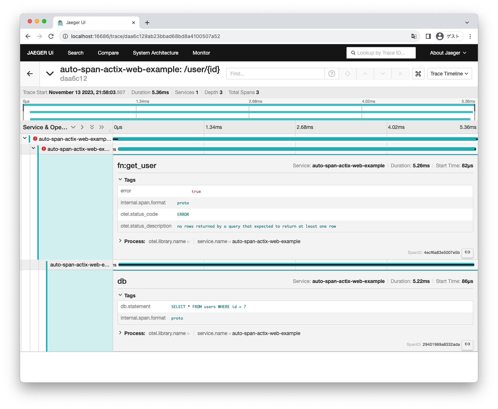

# rust-opentelemetry-auto-span



## Usage

add dependencies

```toml
[dependencies]
opentelemetry-auto-span = "0.3"
```

annotate function

```rust
use opentelemetry_auto_span::auto_span;

#[get("/user/{id}")]
#[auto_span]
async fn get_user(
    id: web::Path<(i64,)>,
    db: web::Data<sqlx::MySqlPool>,
) -> actix_web::Result<HttpResponse, Error> {
    let user: User = sqlx::query_as("SELECT * FROM users WHERE id = ?")
        .bind(id.into_inner().0)
        .fetch_one(&**db)
        .await?;
    Ok(HttpResponse::Ok().json(&user))
}
```

then, capture bellow information

* function span (from `get_user` start to end)
* `.await` span
* if error return (at `.await?`) and handle by `?`, logging the error

## Convert Example

### use `sqlx::query*`

```rust
#[auto_span]
async fn get_user(
    id: web::Path<(i64,)>,
    db: web::Data<sqlx::MySqlPool>,
) -> actix_web::Result<HttpResponse, Error> {
    let user: User = sqlx::query_as("SELECT * FROM users WHERE id = ?")
        .bind(id.into_inner().0)
        .fetch_one(&**db)
        .await?;
    Ok(HttpResponse::Ok().json(&user))
}
```

↓

```rust
async fn get_user(
    id: web::Path<(i64,)>,
    db: web::Data<sqlx::MySqlPool>,
) -> actix_web::Result<HttpResponse, Error> {
    #[allow(unused_imports)]
    use opentelemetry::trace::{Span as _, TraceContextExt as _, Tracer as _};
    
    let __otel_auto_tracer = opentelemetry::global::tracer("");
    let __otel_auto_ctx = opentelemetry::Context::current_with_span(__otel_auto_tracer.start("fn:get_user"));
    let __otel_auto_guard = __otel_auto_ctx.clone().attach();
    let __otel_auto_span = __otel_auto_ctx.span();
    
    let user: User = {
        let __otel_auto_ctx = opentelemetry::Context::current_with_span(__otel_auto_tracer.start("db"));
        let __otel_auto_guard = __otel_auto_ctx.clone().attach();
        let __otel_auto_span = __otel_auto_ctx.span();
        __otel_auto_span.set_attribute(opentelemetry::KeyValue::new("code.lineno", 52i64));
        __otel_auto_span.set_attribute(opentelemetry::KeyValue::new(
            "code.line",
            "let user: User = sqlx::query_as(\"SELECT * FROM users WHERE id = ?\")",
        ));
        {
            __otel_auto_span.set_attribute(opentelemetry::KeyValue::new(
                "db.statement",
                "SELECT * FROM users WHERE id = ?",
            ));
            sqlx::query_as("SELECT * FROM users WHERE id = ?")
        }
            .bind(id.into_inner().0)
            .fetch_one(&**db)
            .await
    }
        .map_err(|e| {
            __otel_auto_span.set_status(::opentelemetry::trace::Status::error(format!("{}", e)));
            __otel_auto_span.set_attribute(opentelemetry::KeyValue::new("code.lineno", 52i64));
            __otel_auto_span.set_attribute(opentelemetry::KeyValue::new(
                "code.line",
                "let user: User = sqlx::query_as(\"SELECT * FROM users WHERE id = ?\")",
            ));
            e
        })?;
    Ok(HttpResponse::Ok().json(&user))
}

```

## Option

usage:

```rust
#[auto_span(debug)]
fn my_func() {}
```

| name          | action                                                         |
|:--------------|:---------------------------------------------------------------|
| debug         | Dump the migrated code to ./target/auto_span or /tmp/auto_span |
| all_await     | Generate span for all `await`                                  |
